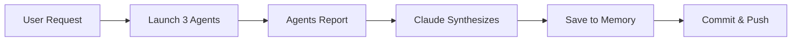

## Introduction

This guide explains the core concepts, agents, and tools available in **Claude Code**, and shows a practical case of running multiple agents in parallel.

## Key Concepts

<dl>
  <dt>**Memory**</dt>
  <dd>Markdown files with project context. Location: `~/.claude/projects/<project>/memory/`. Read-only for agents.</dd>

  <dt>**Skills**</dt>
  <dd>Packaged prompts for common tasks. Location: `~/.claude/skills/`. Invoked like `/skill-name`.</dd>

  <dt>**Agents / Sub-agents**</dt>
  <dd>Separate Claude instances working in parallel (spawned via Task tool).</dd>

  <dt>**MCP Servers**</dt>
  <dd>Services that connect Claude to external tools via Model Context Protocol (configured in `~/.claude/mcp.json`).</dd>
</dl>

## Sub-Agent Types

| Type | Use Case | Speed |
|------|----------|-------|
| **General-purpose** | Complex multi-step tasks, research, analysis | Medium |
| **Explore** | Quick codebase/file discovery (Glob, Grep, Read) | Fast |
| **Plan** | Architecture and implementation design before coding | Medium |
| **Bash** | Run terminal commands when needed | Fast |

## Tools Overview

| Tool | Description |
|------|-------------|
| `Read(file_path)` | Read a file |
| `Write(file_path, content)` | Create a new file |
| `Edit(old, new)` | Modify existing files |
| `Glob(pattern)` | Find files by pattern |
| `Grep(pattern)` | Search file contents |
| `Bash(command)` | Run shell commands |
| `Task(subagent_type, prompt)` | Launch sub-agents |
| `WebFetch(url, prompt)` / `WebSearch(query)` | Web interactions |

## Anatomy of an Effective Agent Prompt

Structure your prompt like this:

1. **Agent identification**: who you are and the project
2. **Objective**: a clear, specific goal
3. **Context**: relevant project info and files
4. **Deliverables**: detailed list of outputs
5. **Output format**: exact format required for copy-paste or PR-ready content

### Example (Content Agent)

```text
Eres el CONTENT & CONTEXT AGENT para <Project>.

## Objetivo
Reescribir secciones clave para posicionar el sitio como AI-first.

## Contexto
- Archivo: src/routes/(marketing)/+page.svelte
- Servicios actuales: 3 (expandir a 5)

## Tarea
1. Reescribir hero section
2. Actualizar stats

## Formato
Proveer textos exactos listos para pegar.
```

## Case Study: 3 Agents in Parallel

### Task Distribution

- **Task 1 — Content Agent**: Update copy to position as AI experts
- **Task 2 — Brand Protection Agent**: Audit brand, legal, credibility
- **Task 3 — Programmer Agent**: Review code structure and bugs

### Benefits

- **Speed**: parallel execution saved time
- **Specialization**: each agent focuses on distinct concerns
- **Full context**: agents receive project history and files

## Effective Patterns

Choose the pattern that fits project size and modularity:

- **By specialization**: content / design / legal
- **By file/module**: frontend / backend / DB
- **By phase**: research / design / implementation

## Tips & Tricks

:::tip
Use agents for broad or multi-file work; do small edits yourself.
:::

:::caution
Parallelize truly independent tasks — avoid parallelizing dependent steps.
:::

> **Note**: Agents can access prior conversation history and project files, but not changes made after they start or other agents' live results.

## Full Workflow Example



1. User requests an AI-first homepage
2. Launch 3 specialized agents in parallel
3. Agents report results and Claude synthesizes changes
4. Save reports to `memory/`, commit and push to Git

## Essential Commands

| Command | Description |
|---------|-------------|
| `/tasks` | List active tasks |
| `/install <skill>` | Install a skill |
| `/skills` | List available skills |
| `/commit` | Commit changes |
| `/review-pr <id>` | Review pull request |
| `EnterPlanMode()` / `ExitPlanMode()` | Planning sessions |

## Next Steps

**Level 1**: Use `Task` for small parallel searches and save findings to memory.

**Level 2**: Launch 3 agents for a complex task and create a custom skill.

**Level 3**: Design a 5+ agent workflow and integrate a custom MCP server.

## Resources

- [Skills docs](file://~/.claude/skills/README.md) — Local documentation
- [MCP Protocol](https://modelcontextprotocol.io) — Model Context Protocol specification
- [Claude Code GitHub](https://github.com/anthropics/claude-code) — Official repository

## Conclusion

Claude Code represents a significant shift in how developers interact with AI tools. By leveraging **memory**, **skills**, and **parallel agents**, you can dramatically improve your development workflow. 

Start with simple tasks and gradually build up to complex multi-agent workflows as you become more comfortable with the system.
